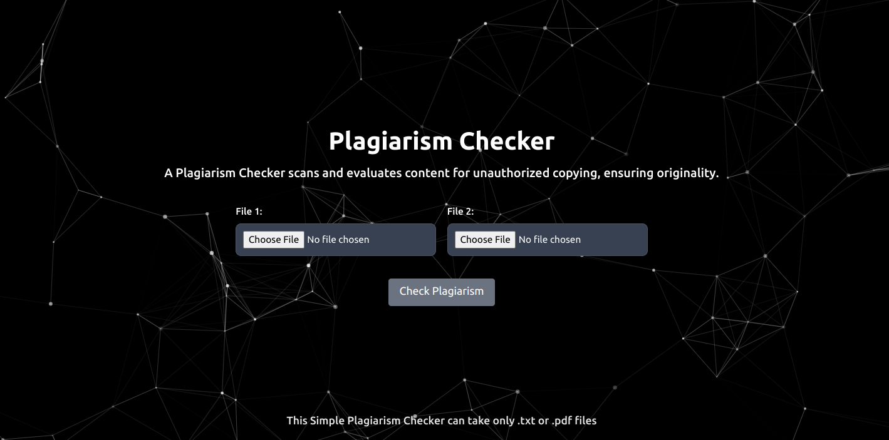

# Plagiarism Checker

Build a COMPLETE Plagiarism Checker App with React, Flask, Ai



### Installing

To run only the client, run:

```
$ npm run start
```

To run only the server, run:

```
$ cd server
$ pip install -r requirements.txt
$ python3 server.py
```

To build the Docker images, navigate to each directory containing the Dockerfile and run

```
docker build -t my-react-app ./
docker build -t my-flask-app ./server
```

```
docker run -d -p 3000:80 my-react-app
docker run -d -p 5000:5000 my-flask-app
```
